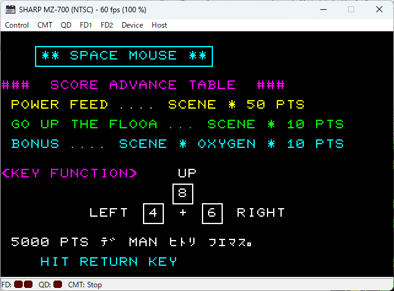
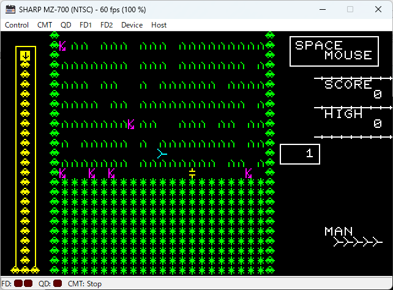
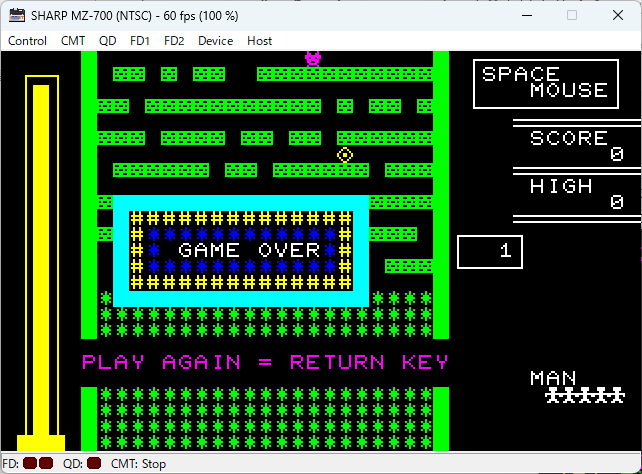

# スペース・マウス MZ-700 パッチ

## はじめに

工学社の雑誌 I/O 1981年10月号掲載の芸夢狂人氏のスペース・マウスを MZ-700 で動作させるためのパッチです。

| タイトル画面           | ゲーム画面           |
| --                 | --                   |
| | |

## 実行環境

- MZ-700
- PCG-700

※ 動作確認はエミュレータのみ。

## ビルド

### 必要なもの

- [AILZ80ASM](https://github.com/AILight/AILZ80ASM)
    - AILight（Mitsuhito Ishino）氏作成の Z80 アセンブラです。
- スペース・マウス プログラム（機械語）
    - 雑誌 I/O 1981年10月にチェックリスト付き16進ダンプリストで掲載されたものです。
    - machine.bin というファイル名で保存してください。

### ビルド方法

- build.cmd を実行します。
- AILZ80ASM の出力形式として mzt を指定していますが、2025年1月18日現在は利用できませんので、次のいずれかの方法で実行環境にあったファイルとしてください。
1. bin, cmt 等の形式を指定して出力した後に、mzt に変換する。
2. AILZ80ASM が対応するまで待ってからビルドする（※）。
3. fork リポジトリ [https://github.com/dogatana/AILZ80ASM](https://github.com/dogatana/AILZ80ASM) の output-mzt ブランチからビルドした AILZ80ASM を使用して mzt 形式を出力する。

__※__ pull request を発行していますが、採用されるかどうかを含め対応時期は未確定です。

## 利用方法

- PCG-700 を利用する設定とします。
- アドレス $1200 から起動します。
- 「PCG-8100 がありますか」について N とした場合に非PCG版として動作しますが、キャラクタコードの調整は行っていないので、なかなかシュールな絵柄になります。
- タイトル画面で RETRUN（Enter）を押すとスペース・マウス本体が起動します。
    - 移動は 2/6/4 の他 ←/↑/→ を使用可能
    - ゲーム中に Q を押すとゲームオーバ
- ゲームオーバー画面で RETURN を押すとゲームを再開します。このとき N でモニタに戻ります。

| 非PCG画面     | ゲームオーバ画面  |
| --            | --                |
|| |

## カスタマイズ

- I/O の記事 『表4 ゲームの変更点』にあるアドレスは $D000 からになっていますが、MZ-700 用に $2400 からにリロケートしています。それを考慮して次のような方法でカスタマイズしてください。
    - モニタから直接修正する。
    - エミュレータのデバッグ機能で修正する。
    - patch_data.inc を追加・修正し、再度ビルドする。
- pathc_data.inc では全体のスピードを 198 行目で修正済みです。(動作させてみたところ、当時はこんなに速くはなかった記憶があったため、遅めに変更)

## 謝辞

- 本パッチ作成にあたり次のサイトを参考にさせていただきました。有用な情報を提供してくださった各位に感謝します。
    - [AKD's site](http://mzakd.cool.coocan.jp/) 
    - [We Love MZ-700](http://www.maroon.dti.ne.jp/youkan/mz700/index.html)
- 芸夢職人氏が公開されている スペースマウス for MZ-80C をMZ-700 エミュレータで動かしたことがパッチ作成のきっかけになりました。芸夢職人氏に感謝します。
- 1980 年代様々なゲームを雑誌を発表された芸夢狂人氏に感謝します。